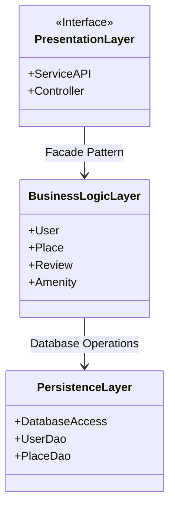
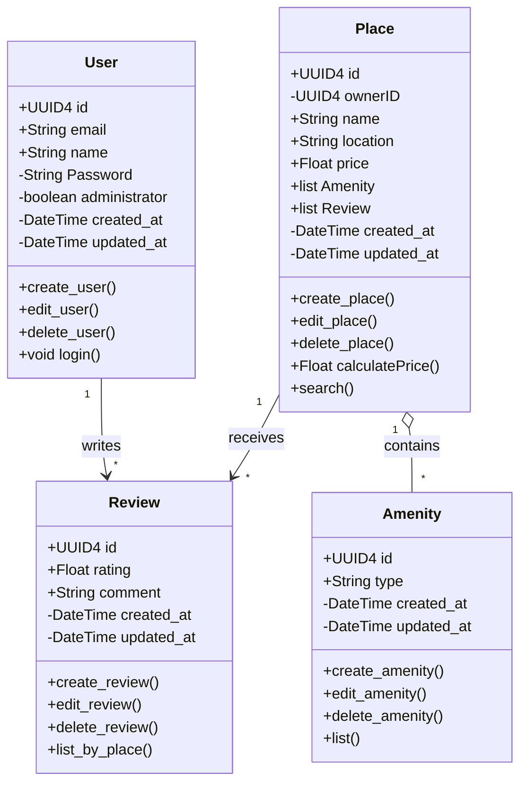
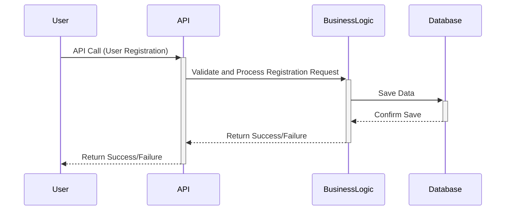
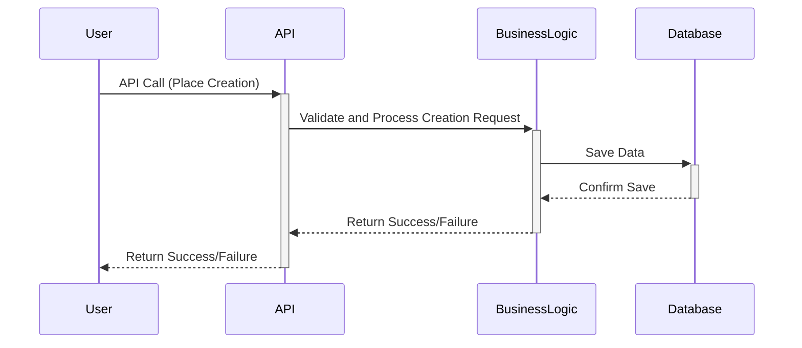
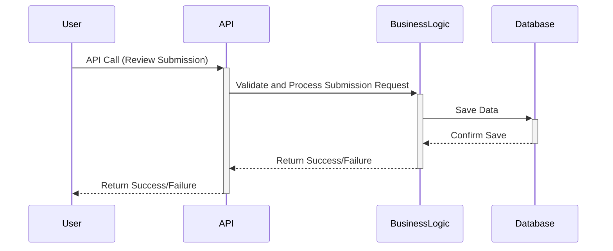
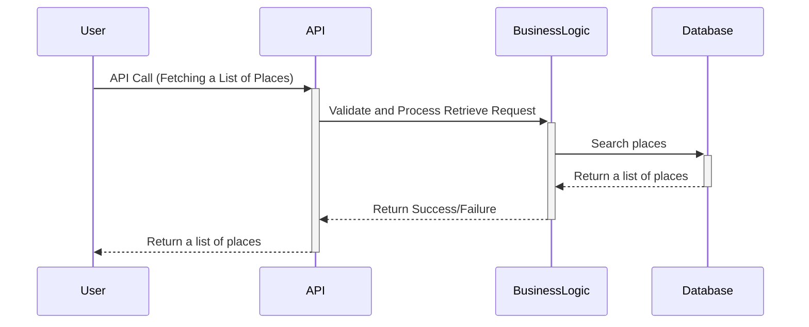

# HBnB Project Technical Documentation

## Introduction

This document provides a comprehensive technical overview of the HBnB project, outlining its architecture, business logic, and interactions between components. The goal is to offer a clear blueprint for the development process, using UML diagrams to represent key parts of the system.

## High-Level Architecture

### High-Level Package Diagram

The diagram below shows the three-layer architecture of the HBnB application. It includes the Presentation Layer, which handles user interactions through APIs and services, the Business Logic Layer, which contains the core models (User, Place, Review, Amenity), and the Persistence Layer, responsible for database operations. The Facade Pattern is used to simplify communication between these layers.

_Explanation:_

- **Presentation Layer**: Manages the user-facing services and APIs.
- **Business Logic Layer**: Contains the application’s core entities and logic.
- **Persistence Layer**: Handles database interactions.
- **Facade Pattern**: Acts as an interface to streamline communication between layers.

## Business Logic Layer

### Class Diagram

The class diagram below illustrates the core entities of the HBnB application, focusing on the Business Logic layer. Each entity is represented as a class, with its attributes and methods. The relationships between classes, such as associations and aggregations, are also shown to highlight how these entities interact.

_Explanation:_

- **User**: Represents the system’s users, with attributes like email, name, and methods for login, create, edit, and delete operations.
- **Place**: Contains details of a property (e.g., location, price), and has methods for creating, editing, and calculating prices.
- **Review**: Captures user feedback for places, with attributes for rating and comment, and methods for managing reviews.
- **Amenity**: Represents features of a place, with methods to add or edit amenities.

## API Interaction Flow

### Sequence Diagrams

The following sequence diagrams show how different API calls are processed within the HBnB application. These diagrams illustrate the interaction between components in different scenarios.

#### User Registration

The user registration diagram demonstrates the flow of information from the presentation layer, through the business logic, and finally to the persistence layer when a new user is registered.

#### Place Creation

This diagram shows the interaction for creating a new place. It begins at the presentation layer with an API call and follows through to the business logic and database layers.

#### Review Submission

The review submission process allows a user to leave feedback for a place. This diagram outlines how the system handles a new review, linking it to both the user and the place.

#### Retrieve List of Places

This sequence diagram demonstrates how the system retrieves a list of places based on user queries, interacting with both the business logic and the persistence layer.

## Conclusion

This technical document serves as a detailed guide for the HBnB project, offering both visual representations and explanations of the system’s architecture and design. The diagrams presented here provide a strong foundation for the implementation phase, ensuring that each layer and component of the application is clearly understood.
